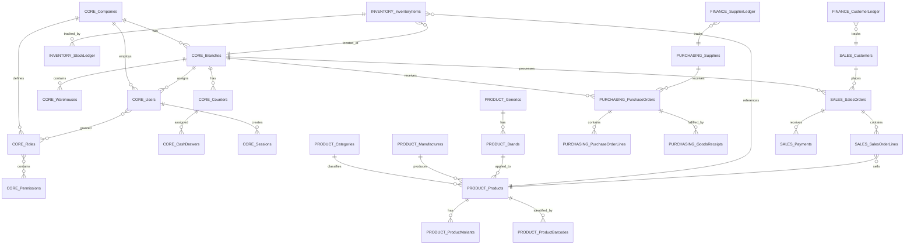

# Entity Relationship Model

## PharmaX Enterprise Platform

**Version:** 1.0  
**Document ID:** ERD-001  
**Created:** WO-0003  
**Status:** Approved  

---

## Overview

This document presents the Entity Relationship Diagram (ERD) for the PharmaX Enterprise database. The model follows Third Normal Form (3NF) and supports both single-pharmacy and multi-branch enterprise deployments.

---

## High-Level ERD (Mermaid)



---

## Module Boundaries

### Core Module (Organization & Security)

| Entity | Parent | Relationships |
|--------|--------|---------------|
| Companies | - | Has many Branches, Users, Roles |
| Branches | Companies | Belongs to Company, Has Warehouses, Counters |
| Warehouses | Branches | Belongs to Branch |
| Counters | Branches | Belongs to Branch, Has CashDrawers |
| CashDrawers | Counters | Assigned to Counter |
| Users | Companies | Employed by Company, Assigned to Branches |
| Roles | Companies | Defined by Company, Has Permissions |
| Permissions | - | System-defined, Assigned to Roles |
| UserRoles | Users, Roles | Association table |
| RolePermissions | Roles, Permissions | Association table |
| Sessions | Users | Created by User |

---

### Product Module (Catalog)

| Entity | Parent | Relationships |
|--------|--------|---------------|
| Categories | Companies | Hierarchical (self-referential) |
| Manufacturers | Companies | Produces Products |
| Generics | - | Has many Brands |
| Brands | Generics, Manufacturers | Applied to Products |
| Units | - | Used by Products |
| Products | Companies, Categories | Has Variants, Barcodes |
| ProductVariants | Products | Specific packaging/sizes |
| ProductBarcodes | Products | Machine identifiers |

---

### Inventory Module

| Entity | Parent | Relationships |
|--------|--------|---------------|
| InventoryItems | Branches, Products | Tracks stock per batch |
| StockLedger | InventoryItems | Immutable transaction log |
| StockMovements | InventoryItems | Documents flow |
| Adjustments | Branches | Corrections |
| Transfers | Branches (from/to) | Inter-location moves |

---

### Purchasing Module

| Entity | Parent | Relationships |
|--------|--------|---------------|
| Suppliers | Companies | Vendors |
| PurchaseOrders | Branches, Suppliers | Orders to suppliers |
| PurchaseOrderLines | PurchaseOrders | Line items |
| GoodsReceipts | PurchaseOrders | Received goods |
| PurchaseInvoices | PurchaseOrders | Supplier bills |
| SupplierReturns | PurchaseOrders | Returns to vendor |

---

### Sales Module

| Entity | Parent | Relationships |
|--------|--------|---------------|
| Customers | Companies | Buyers |
| SalesOrders | Branches, Customers | Sales transactions |
| SalesOrderLines | SalesOrders | Line items |
| SalesInvoices | SalesOrders | Customer bills |
| Payments | SalesOrders | Customer payments |
| SalesReturns | SalesOrders | Customer returns |

---

### Finance Module

| Entity | Parent | Relationships |
|--------|--------|---------------|
| CashBooks | Branches | Cash tracking |
| BankBooks | Companies | Bank accounts |
| Expenses | Companies | Operational costs |
| Incomes | Companies | Revenue |
| CustomerLedger | Customers | AR tracking |
| SupplierLedger | Suppliers | AP tracking |
| TaxRates | Companies | Tax definitions |

---

## Aggregate Boundaries

```
┌─────────────────────────────────────────────────────────────┐
│                    COMPANY AGGREGATE                        │
│  ┌───────────┐                                              │
│  │ Companies │◄───────────────────────────────────────┐     │
│  └─────┬─────┘                                       │     │
│        │                                             │     │
│  ┌─────▼─────┐  ┌───────────┐  ┌───────────┐        │     │
│  │ Branches  │  │  Users    │  │   Roles   │        │     │
│  └─────┬─────┘  └─────┬─────┘  └─────┬─────┘        │     │
│        │              │              │                │     │
│  ┌─────▼─────┐  ┌─────▼─────┐  ┌─────▼─────┐        │     │
│  │ Warehouses│  │ Sessions  │  │Permissions│        │     │
│  │ Counters  │  │ UserRoles │  │RolePermis.│        │     │
│  │CashDrawers│  └───────────┘  └───────────┘        │     │
│  └───────────┘                                       │     │
└───────────────────────────────────────────────────────┼─────┘
                                                        │
┌───────────────────────────────────────────────────────┼─────┐
│                   PRODUCT AGGREGATE                   │     │
│  ┌───────────┐                                        │     │
│  │Categories │◄───────────────────────────────────────┤     │
│  └─────┬─────┘                                        │     │
│        │                                              │     │
│  ┌─────▼─────────────────────────────────────────┐    │     │
│  │                  Products                     │    │     │
│  │  ┌─────────────┐  ┌───────────────┐          │    │     │
│  │  │ Variants    │  │   Barcodes    │          │    │     │
│  │  └─────────────┘  └───────────────┘          │    │     │
│  └───────────────────────────────────────────────┘    │     │
│                                                       │     │
│  ┌───────────┐  ┌───────────┐  ┌───────────┐         │     │
│  │Manufact.  │  │ Generics  │  │  Brands   │         │     │
│  └───────────┘  └───────────┘  └───────────┘         │     │
└───────────────────────────────────────────────────────┼─────┘
                                                        │
┌───────────────────────────────────────────────────────┼─────┐
│                 INVENTORY AGGREGATE                   │     │
│  ┌─────────────────────────────────────────────┐      │     │
│  │            InventoryItems                   │      │     │
│  │  ┌─────────────┐  ┌───────────────┐        │      │     │
│  │  │StockLedger  │  │StockMovement  │        │      │     │
│  │  └─────────────┘  └───────────────┘        │      │     │
│  └─────────────────────────────────────────────┘      │     │
│                                                       │     │
│  ┌───────────┐  ┌───────────┐  ┌───────────┐         │     │
│  │Adjustments│  │ Transfers │  │  Damages  │         │     │
│  └───────────┘  └───────────┘  └───────────┘         │     │
└───────────────────────────────────────────────────────┼─────┘
                                                        │
┌───────────────────────────────────────────────────────┼─────┐
│                PURCHASING AGGREGATE                   │     │
│  ┌───────────┐                                        │     │
│  │ Suppliers │◄───────────────────────────────────────┤     │
│  └─────┬─────┘                                        │     │
│        │                                              │     │
│  ┌─────▼─────────────────────────────────────────┐    │     │
│  │           PurchaseOrders                      │    │     │
│  │  ┌─────────────┐  ┌───────────────┐          │    │     │
│  │  │ PO Lines    │  │Goods Receipts │          │    │     │
│  │  └─────────────┘  └───────────────┘          │    │     │
│  └───────────────────────────────────────────────┘    │     │
│                                                       │     │
│  ┌───────────────────┐  ┌───────────────────┐        │     │
│  │ PurchaseInvoices  │  │ SupplierReturns   │        │     │
│  └───────────────────┘  └───────────────────┘        │     │
└───────────────────────────────────────────────────────┼─────┘
                                                        │
┌───────────────────────────────────────────────────────┼─────┐
│                   SALES AGGREGATE                     │     │
│  ┌───────────┐                                        │     │
│  │ Customers │◄───────────────────────────────────────┤     │
│  └─────┬─────┘                                        │     │
│        │                                              │     │
│  ┌─────▼─────────────────────────────────────────┐    │     │
│  │             SalesOrders                       │    │     │
│  │  ┌─────────────┐  ┌───────────────┐          │    │     │
│  │  │ SO Lines    │  │   Payments    │          │    │     │
│  │  └─────────────┘  └───────────────┘          │    │     │
│  └───────────────────────────────────────────────┘    │     │
│                                                       │     │
│  ┌───────────────────┐  ┌───────────────────┐        │     │
│  │ SalesInvoices     │  │  SalesReturns     │        │     │
│  └───────────────────┘  └───────────────────┘        │     │
└───────────────────────────────────────────────────────┼─────┘
                                                        │
┌───────────────────────────────────────────────────────┼─────┐
│                  FINANCE AGGREGATE                    │     │
│  ┌───────────┐  ┌───────────┐  ┌───────────┐        │     │
│  │CashBooks  │  │BankBooks  │  │ Expenses  │        │     │
│  └───────────┘  └───────────┘  └───────────┘        │     │
│                                                      │     │
│  ┌───────────────────┐  ┌───────────────────┐       │     │
│  │CustomerLedger     │  │SupplierLedger     │       │     │
│  └───────────────────┘  └───────────────────┘       │     │
└───────────────────────────────────────────────────────┘
```

---

## Cardinality Summary

| Relationship | From | To | Cardinality |
|--------------|------|-----|-------------|
| Company → Branch | Companies | Branches | 1:N |
| Company → User | Companies | Users | 1:N |
| Company → Role | Companies | Roles | 1:N |
| Branch → Warehouse | Branches | Warehouses | 1:N |
| Branch → Counter | Branches | Counters | 1:N |
| Branch → SalesOrder | Branches | SalesOrders | 1:N |
| Branch → PurchaseOrder | Branches | PurchaseOrders | 1:N |
| Counter → CashDrawer | Counters | CashDrawers | 1:N |
| User → Session | Users | Sessions | 1:N |
| User → UserRole | Users | UserRoles | 1:N |
| Role → UserRole | Roles | UserRoles | 1:N |
| Role → RolePermission | Roles | RolePermissions | 1:N |
| Permission → RolePermission | Permissions | RolePermissions | 1:N |
| Category → Category (self) | Categories | Categories | 1:N |
| Category → Product | Categories | Products | 1:N |
| Manufacturer → Product | Manufacturers | Products | 1:N |
| Generic → Brand | Generics | Brands | 1:N |
| Brand → Product | Brands | Products | 1:N |
| Product → ProductVariant | Products | ProductVariants | 1:N |
| Product → ProductBarcode | Products | ProductBarcodes | 1:N |
| Branch → InventoryItem | Branches | InventoryItems | 1:N |
| Product → InventoryItem | Products | InventoryItems | 1:N |
| InventoryItem → StockLedger | InventoryItems | StockLedger | 1:N |
| Supplier → PurchaseOrder | Suppliers | PurchaseOrders | 1:N |
| PurchaseOrder → POLine | PurchaseOrders | PurchaseOrderLines | 1:N |
| PurchaseOrder → GoodsReceipt | PurchaseOrders | GoodsReceipts | 1:N |
| Customer → SalesOrder | Customers | SalesOrders | 1:N |
| SalesOrder → SOLine | SalesOrders | SalesOrderLines | 1:N |
| SalesOrder → Payment | SalesOrders | Payments | 1:N |

---

## Version History

| Version | Date | Author | Changes |
|---------|------|--------|---------|
| 1.0 | WO-0003 | Architecture Team | Initial ERD release |

---

# References

- [Canonical Data Model](13-canonical-data-model.md)
- [Database Architecture](14-database-architecture.md)
- [Domain Model](03-domain-model.md)
